# Obsidian Settings Options Management

「Settings Options Management」 add a menu in the buttom right corner of the Settings Options which can select settings-item(enabled, disabled, all) and adjust the layout of the current page(list/grid). This plugin makes it easy for people who have multiple plugins or multiple css snippets to manage their plugins and css.

## Feature

### 「Settings -> Appearance -> CSS snippets」

A menu in the buttom right corner of 'Appearace'.

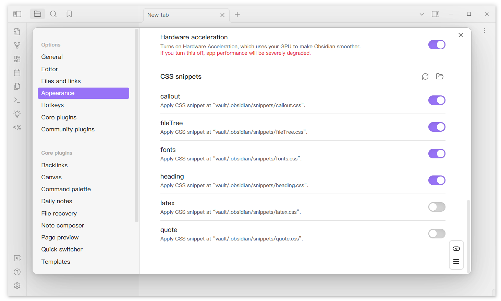

Show all enabled/disabled css snippets.

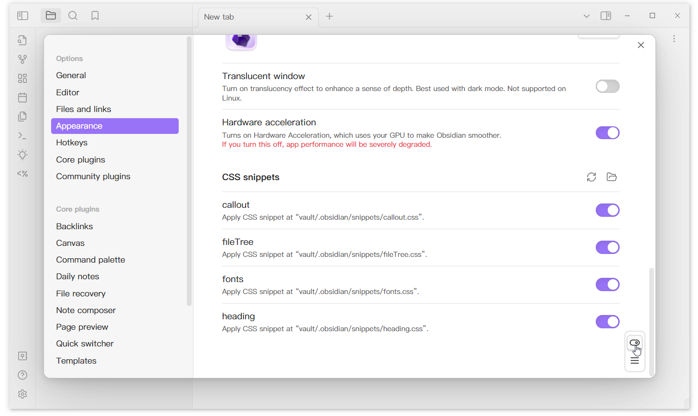

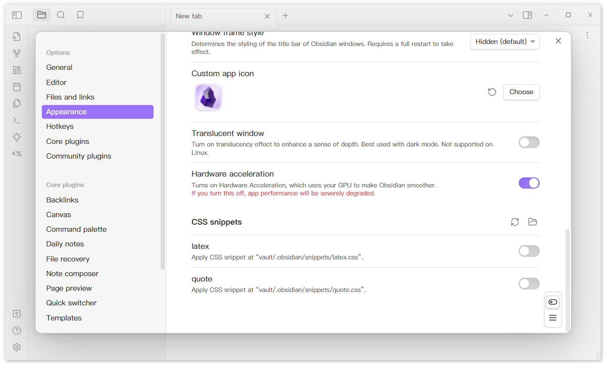

Grid layout

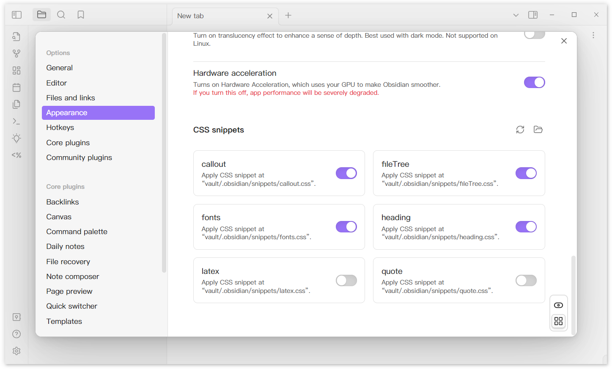

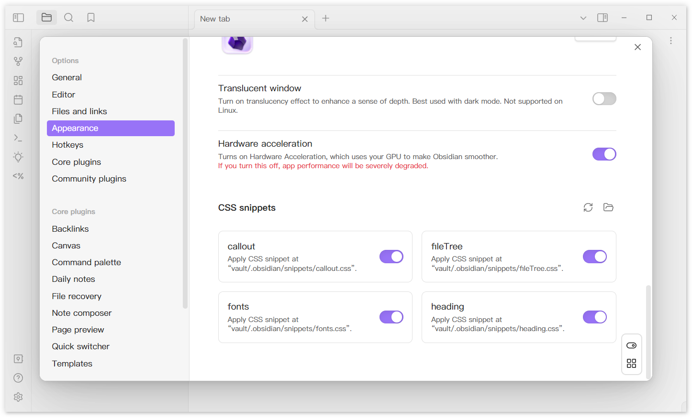

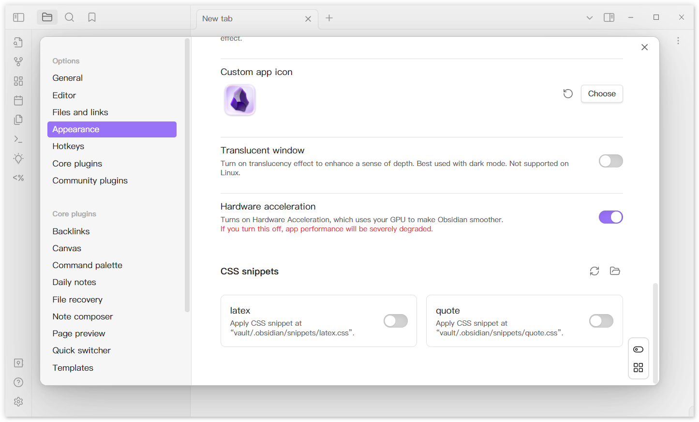

### 「Settings -> Hotkeys」

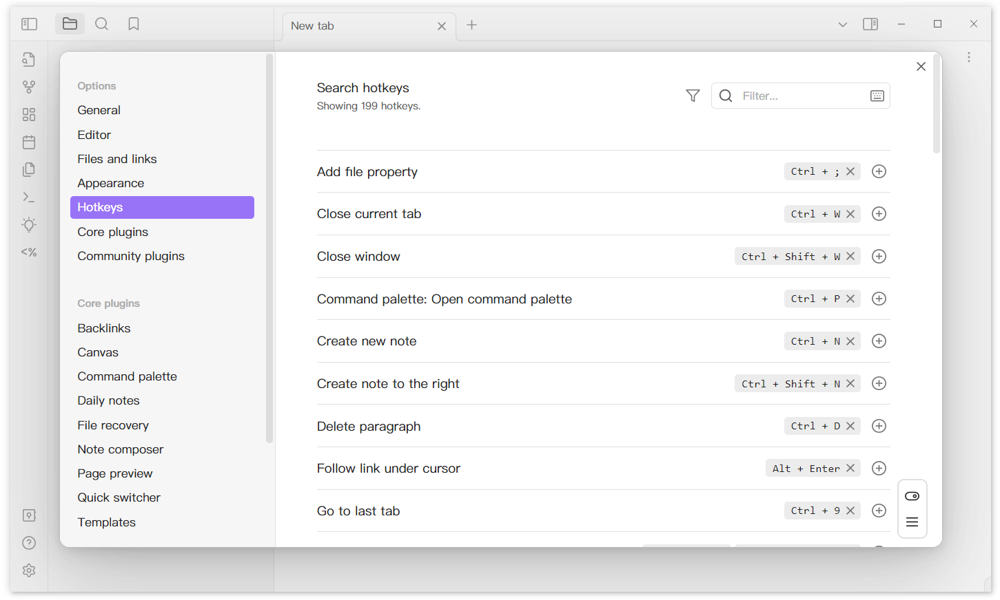

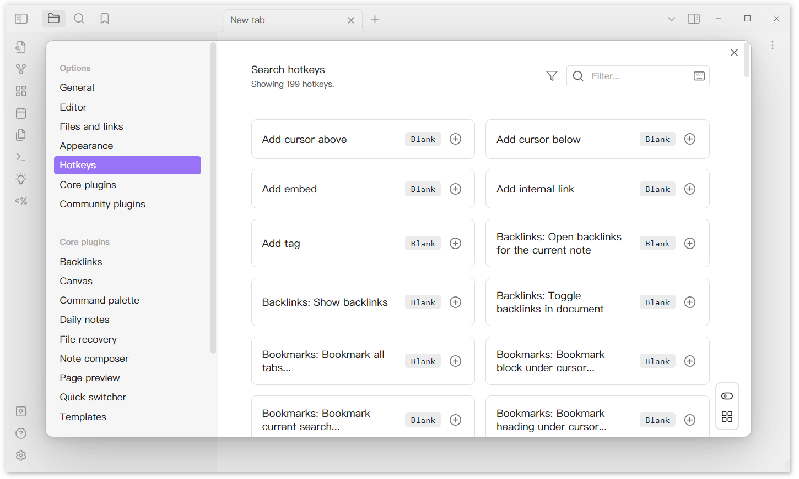

### 「Settings -> Core plugins」

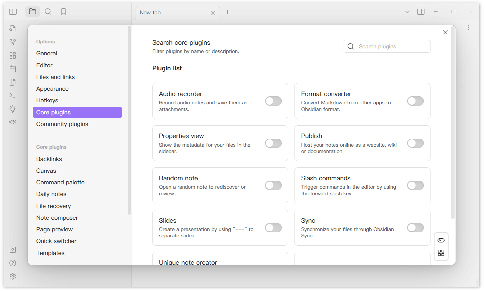

### 「Settings -> Community Plugins」

Show all enabled/disabled plugins.

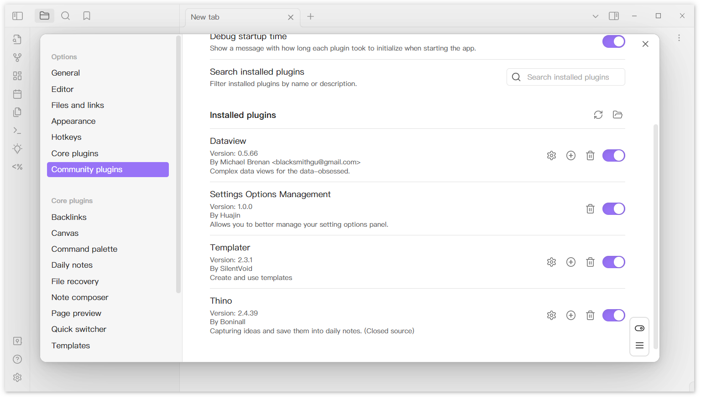

Grid layout

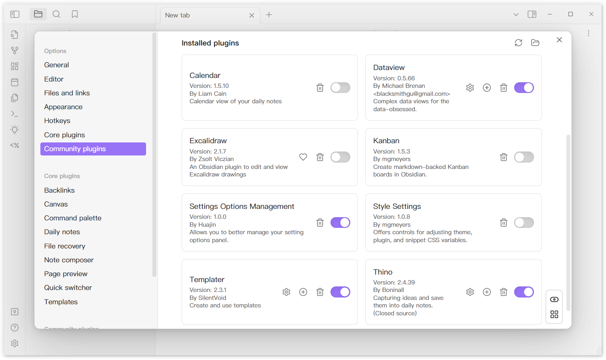

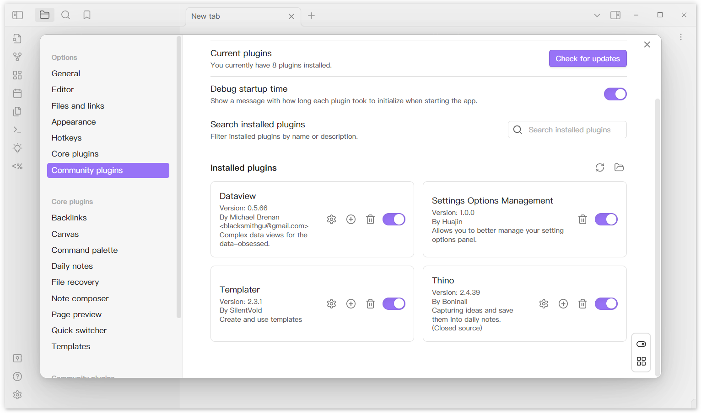

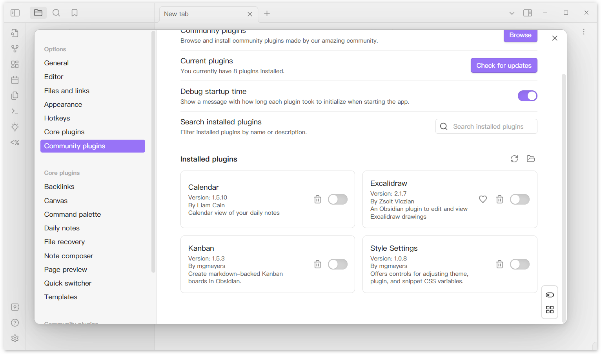