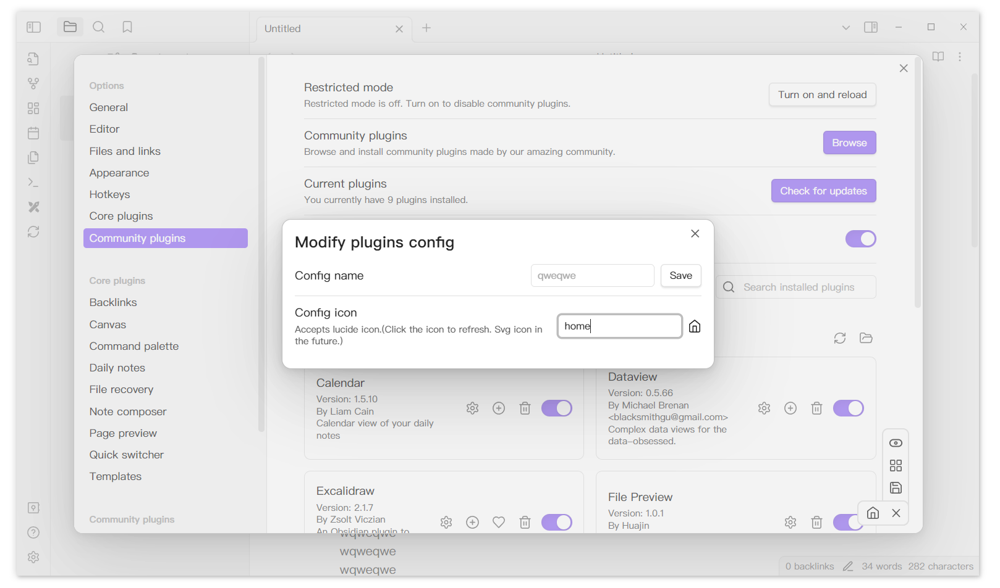

# Overview

This plugin add a menu in the buttom right corner of the Settings Tab. It provides some functions.

- Show all enabled/disabled plugins and css
- Grid layout
- Save current plugins/css enable config
- Quickly enable/disable the configuration that you saved.

## Feature

### Show all enabled/disabled plugins and css.

### Grid Layout

### About Configuration

Save current config and enabled it.

Right click the config can open a menu to delete or rename the config.

Support use lucide icon as custom config icon. (https://lucide.dev/)

### Additional

If you encounter styling issues, verify that your Obsidian version is 1.11.7 or higher. If you are using a version below 1.11.7, please download version 1.0.6 of this plugin from the releases page.
